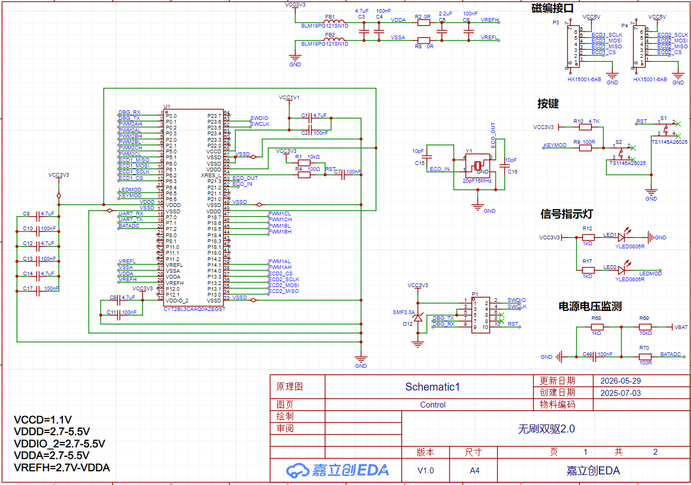
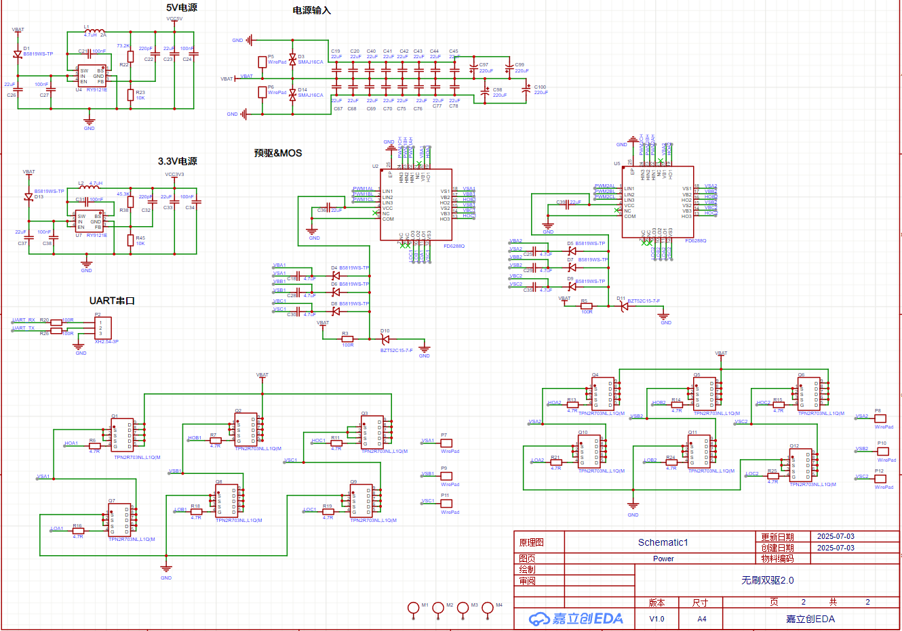

# 双路无刷电机控制器

面向双电机运动控制设计的无刷双驱板，将板载 MCU、双路磁编码器接口、控制输入、电源监测、两套栅极预驱与三相 MOSFET 功率级集成在同一 PCB 上。

## 

- 控制页集成 CYT2BL3 系列 MCU、时钟、复位、按键、状态 LED 与 UART 调试接口。
- 为两路磁编码器分别规划 SPI 信号及 5 V 供电接口，支持电机位置/速度反馈接入。
- 设计 5 V 与 3.3 V 辅助电源、电源输入保护和母线电压监测。
- 使用两套预驱与 MOSFET 三相桥构成双路无刷功率级，并规划 A/B 两组相线接口。
- 在板上对控制区与大电流功率区进行功能分区，完成顶层、底层布局布线检查。

## 设计资料

BLDC、三相逆变桥、栅极预驱、功率 MOSFET、SPI 磁编码器、UART、PCB Layout

## 文件说明

- `无刷双驱.epro`：完整原理图与 PCB 工程。
- `schematic-control.png`：MCU、编码器、按键、状态指示与采样接口。
- `schematic-power-stage.png`：输入电源、辅助电源及双路预驱/MOS 功率级。
- `pcb-layout-top.png`、`pcb-layout-bottom.png`：PCB 正反面布局布线。

