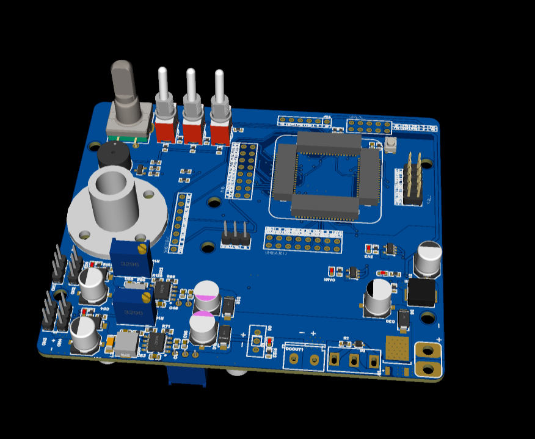

# TC264D 核心板与系统载板

围绕 Infineon AURIX TC264D 搭建的主控硬件设计集合，包含紧凑型核心板和面向整机接口扩展的系统载板方案，覆盖 MCU 最小系统、多电压域供电、时钟/复位、调试下载、引脚扇出与外围接口布局。

## 

- 设计 TC264D 最小系统，完成多单元 MCU 原理图、去耦、电源域、晶振与复位电路连接。
- 将 MCU 可用引脚通过板边排针/连接器扇出，便于作为可复用核心模块接入不同系统。
- 开发约 52.07 mm × 44.50 mm 的紧凑版本，在有限板框内完成高密度器件与接口布局。
- 迭代系统载板方案，预留核心模块、显示/通信连接器、旋钮和开关等人机接口位置。
- 通过正反面布线图与 3D 渲染检查器件方向、机械空间和接口可达性。

嘉立创 EDA Pro、Infineon AURIX TC264D、多电压域供电、最小系统、BGA/LQFP 扇出、PCB Layout

## 文件说明

- `tc264核心板miniv3.1.epro`：紧凑型 TC264 核心板工程。
- `TC264D核心板.epro`：TC264D 核心/系统板工程。
- `tc264-mini-pcb-*.png`：小型核心板顶层与底层布局。
- `tc264d-core-board-pcb-*.png`：核心板扩展版本布局。
- `tc264d-system-board-pcb-*.png`：系统载板正反面布局。
- `tc264d-system-board-3d-*.png`：系统载板正反面三维效果。

