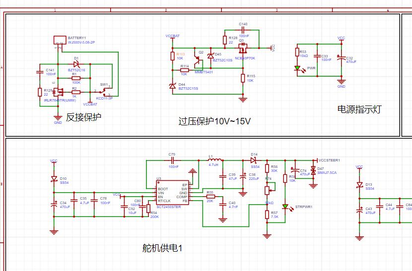
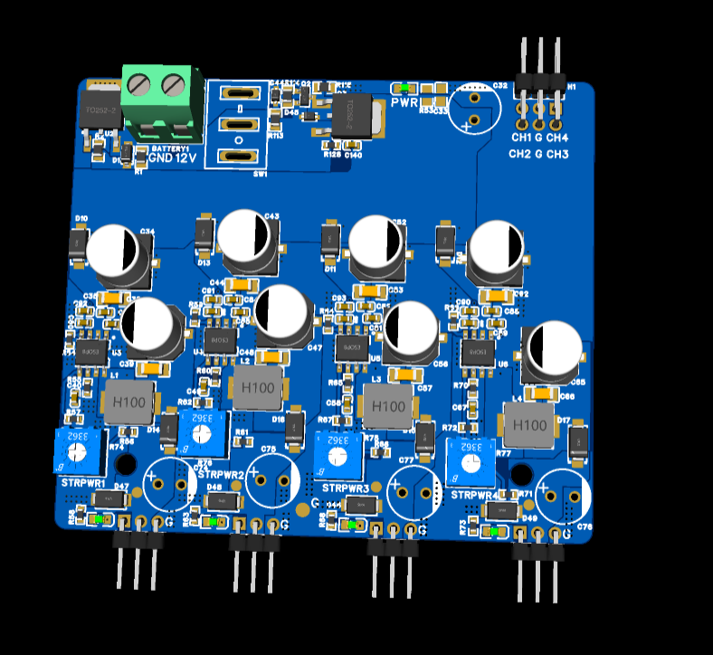

# 四路舵机独立电源板

面向多舵机系统设计的四通道降压供电板，将输入保护、电压监测、四路独立电源变换和舵机信号接口集成在同一 PCB 上，降低多个舵机同时动作时的电源耦合与压降风险。

## 

- 设计 12 V 电源输入与开关控制，并加入反接保护、电源指示和 TVS/稳压器件。
- 使用比较与 MOSFET 控制网络实现约 10–15 V 的输入过压保护逻辑。
- 布置四路独立 Buck 降压通道，每路配置输入/输出滤波与大容量储能电容。
- 将四路舵机控制信号与对应电源、地线集中引出，便于主控连接和线束管理。
- 完成原理图、PCB 顶层布局及 3D 装配检查。

## 设计资料

嘉立创 EDA Pro、Buck 降压电源、MOSFET、电源保护、PCB Layout、3D 装配检查

## 文件说明

- `舵机电源.epro`：完整 EDA 工程。
- `schematic-overview.png`：输入保护、过压保护与四路舵机供电原理图。
- `buck-converter-reference.png`：降压模块设计与典型应用对照。
- `pcb-layout-top.png`：PCB 顶层布局布线。
- `pcb-3d-top.png`：器件装配三维效果。

